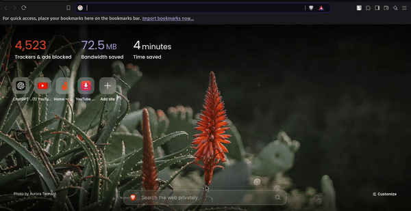

# To-Do List App

A simple and intuitive To-Do List application built with React, which allows users to add, toggle, and delete tasks. The app also uses localStorage to persist tasks across page reloads.

## Table of Contents
- [Features](#features)
- [Demo](#demo)
- [Installation](#installation)
- [Folder Structure](#folder-structure)
- [Technologies Used](#technologies-used)
- [Usage](#usage)
- [Contributing](#contributing)
- [License](#license)

## Features
- **Add Tasks:** Add a new task to the list.
- **Mark as Completed:** Click on the task to toggle between completed and not completed.
- **Delete Tasks:** Easily remove tasks from the list.
- **Persistent Storage:** The app saves tasks using `localStorage`, so your tasks remain after refreshing the page.
- **Responsive Design:** The layout is mobile-friendly and responsive to different screen sizes.

## Demo


## Installation

### Prerequisites
Make sure you have the following installed on your machine:
- [Node.js](https://nodejs.org/) (LTS version recommended)
- [npm](https://www.npmjs.com/) (comes with Node.js)


### Steps
1. **Clone the Repository:**
    ```bash
    git clone https://github.com/Beexoul/ToDo-s-List.git
    cd ToDo's List
    ```

2. **Install Dependencies:**
    ```bash
    npm install
    ```

3. **Start the App:**
    ```bash
    npm run dev
    ```
   This will start the application and open it in your browser at `http://localhost:5173`.

### For React Native (Expo)
If you're running the app as a React Native Expo project:
```bash
npx expo start
```

## Folder Structure
```
├── public/
|   └──Favicon.ico
├── src/
│   ├── assets/
|   │   ├──  delete.png
│   │   ├── not_tick.png
|   │   ├── tick.png
│   │   └── todo_icon.png 
│   ├── mycomponents/
│   │   ├── Todo.jsx
│   │   └── Todoitem.jsx
|   ├── App.css
│   ├── App.jsx
|   ├── index.css
│   └── main.jsx
├── eslint.config.js
├── index.html
├── package-lock.json
├── package.json
├── postcss.config.js
├── README.md
├── tailwind.config.js
├── vite.config.js
```

## Technologies Used
- **React**: JavaScript library for building user interfaces.
- **TailwindCSS**: For styling and layout.
- **LocalStorage**: To store and persist tasks locally in the browser.

## Usage
1. **Add Task**: Type a task in the input field and click the "ADD +" button.
2. **Toggle Task**: Click on a task to mark it as completed or incomplete.
3. **Delete Task**: Click the delete icon to remove a task.

## Contributing
Contributions, issues, and feature requests are welcome! Feel free to check the [issues page](#) if you want to contribute.

1. Fork the repository.
2. Create your feature branch (`git checkout -b feature/new-feature`).
3. Commit your changes (`git commit -am 'Add new feature'`).
4. Push to the branch (`git push origin feature/new-feature`).
5. Create a new Pull Request.

## License
This project is licensed under the MIT License - see the [LICENSE](LICENSE) file for details.

---

Happy Hacking! If you encounter any issues, feel free to open a new issue in this repository.